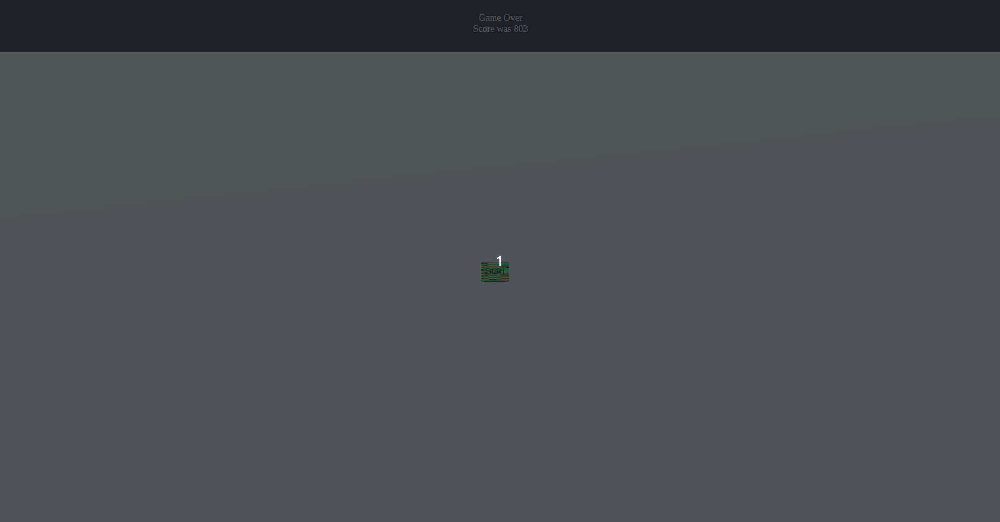

# 🏎️ CAR Racing 007 — Cyberpunk Neon Turbo Edition

A high-octane, real-time neon cyberpunk racing game built with **Vanilla JavaScript**, **CSS3 Glassmorphism**, **Vector SVG Icons**, and **Web Audio API Sound Synthesizer**.



---

## ✨ Features

- **⚡ Collectibles & Point System**:
  - **Data Cubes / Coins**: Grants +250 PTS per pickup, tracks total coins, and triggers combo score multipliers (`x1`, `x2`, `x3`, `x4`).
  - **Nitro Canisters**: Refills +40% of your Nitro Turbo reserve.
  - **Shield Orbs**: Grants temporary invincibility aura that repels traffic collisions.
  - **Repair Kits**: Restores vehicle hull health.

- **🚘 Cyber Car Selection Garage**:
  - Choose between 3 unique playable vehicles with distinct stats (Speed, Armor, Handling):
    - **Cyber Cruiser** (Balanced)
    - **Phantom Speed** (High Speed & Agile Handling)
    - **Vanguard Enforcer** (Heavy Armor Hull)

- **🔥 Nitro Hyper-Speed Boost**:
  - Hold `SHIFT` or `W` to trigger Nitro Boost mode, boosting top speeds past 200 KM/H with particle thruster trails, screen motion lines, and point multipliers.

- **🔊 Synthesized Web Audio Engine**:
  - Built-in Web Audio API sound synthesizer with zero external file dependencies:
    - Pitch-shifted engine rumble matching vehicle velocity.
    - Nitro swoop & coin chime sound effects.
    - Deep collision crash sound effects.
    - Mute / Audio toggle button.

- **🎨 Pure Vector SVG UI & Graphics**:
  - High-definition vector SVG icons for all HUD telemetry, vehicle cards, rating indicators, and collectible items.

- **📱 Responsiveness & Touch Controls**:
  - Mobile touch overlay for smartphones/tablets, seamlessly alongside keyboard support (`WASD`, `Arrow Keys`, `SHIFT`, `SPACE`).

- **🏆 High Score Persistence**:
  - Local Storage saves your personal best score and coin totals across sessions.

---

## 🎮 Controls

| Action | Keyboard | Touch / Mobile |
| :--- | :--- | :--- |
| **Steer Left / Right** | `A` / `D` or `←` / `→` | On-screen Left/Right Buttons |
| **Accelerate / Brake** | `W` / `S` or `↑` / `↓` | — |
| **Nitro Boost** | `SHIFT` or `W` | On-screen BOOST Button |
| **Pause / Resume** | `SPACE` or `P` | — |

---

## 🛠️ Tech Stack & Architecture

- **Core**: HTML5, CSS3, Vanilla JavaScript (ES6+).
- **Typography**: Google Fonts (*Orbitron* & *Rajdhani*).
- **Game Engine**: `requestAnimationFrame` 60FPS loop with AABB collision detection.
- **Audio Synthesizer**: Web Audio API (`OscillatorNode`, `GainNode`, `BiquadFilterNode`).
- **Icons**: Custom Inline Vector SVG Icons.

---

## 🚀 Quick Start

1. Clone the repository:
   ```bash
   git clone https://github.com/shivang007-B/CAR-Racing007.git
   ```
2. Open `index.html` in any modern web browser or serve locally:
   ```bash
   npx serve .
   ```
